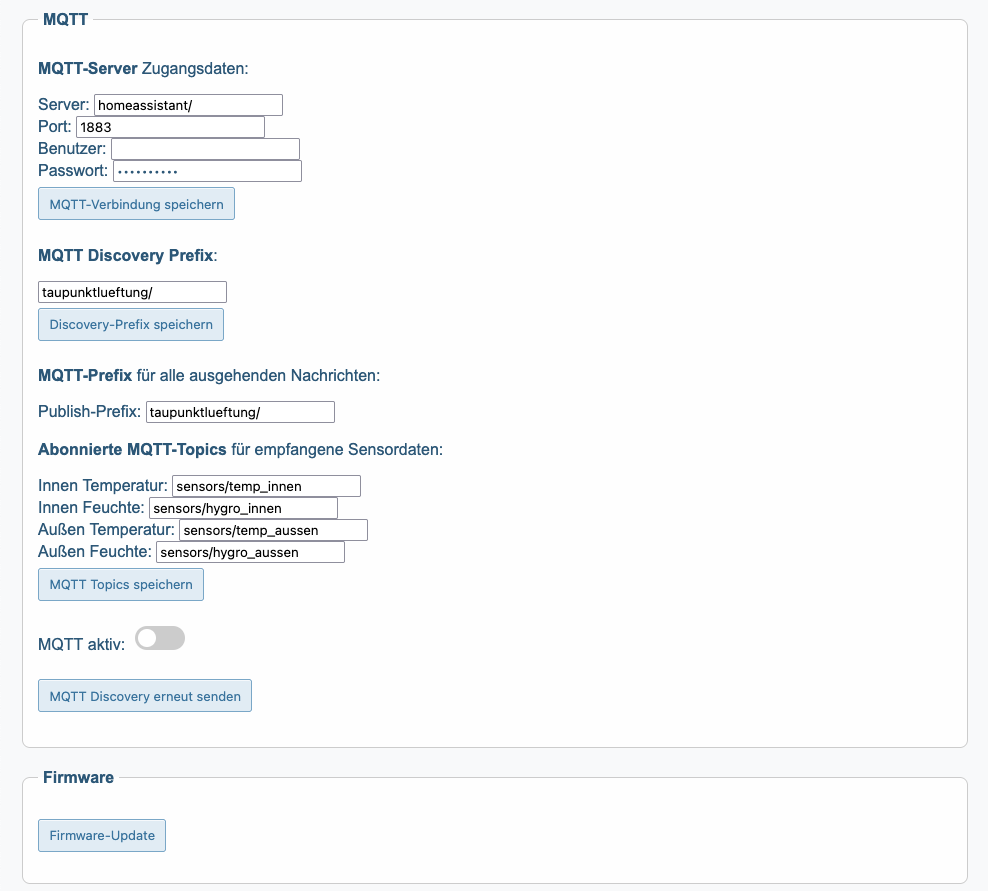

## TaupunktLueftung

TaupunktLueftung ist ein ESP32-basiertes System zur intelligenten Lüftungssteuerung auf Grundlage der Taupunktdifferenz. Es ist ideal zum gezielten Trocknen feuchter Räume wie Keller, Waschküchen oder Vorratskammern – effizient und vollautomatisch.

Das System misst Temperatur und Luftfeuchtigkeit innen und außen (über Sensoren wie z. B. SHT31 oder DHT22 - oder per MQTT), berechnet daraus die Taupunkte und aktiviert die Lüftung nur dann, wenn trocknende Bedingungen vorliegen – also wenn die Außenluft in der Lage ist, Feuchtigkeit aufzunehmen, statt sie einzutragen.

Die Lüftung wird über ein Relais geschaltet – optimalerweise in einem Setup mit zwei Lüftern: einer zieht trockene Luft hinein, der andere führt feuchte Luft ab. Dadurch entsteht ein effektiver Luftstrom zum gezielten Entfeuchten.

[Schnell-Start-Anleitung](quick_start.md)

## Features:

- Taupunktgesteuerte Lüftung zur gezielten Entfeuchtung - ein Algorithmus zur Taupunktanalyse steuert die Lüftung je nach Differenz.

- Webinterface mit Live-Datenanzeige, Echtzeitdiagrammen und Konfigurationbereich

- Einstellbarer Temperaturschutz gegen Auskühlung

- MQTT-Schnittstelle (Publish & Subscribe) + Home Assistant Auto-Discovery

- Modular: wählbare Sensorquelle (Hardware oder MQTT-Daten)

- Unterstützt Firmware-Updates über das Webinterface (OTA) (File: 'TaupunktLueftung.ino.bin')

## Benötigte Komponenten und Aufbau

### Hardware-Komponenten

| Komponente                        | Beschreibung                                            | Ca. Preis (€) |
|----------------------------------|---------------------------------------------------------|---------------|
| **ESP32 Dev Board** (z. B. DOIT) | Mikrocontroller mit WLAN                                | 6–10 €        |
| **SHT31 Sensor (Innen)**         | Temperatur & Luftfeuchte (hochgenau)                    | 5–8 €         |
| **DHT22 Sensor (Außen)**         | Temperatur & Luftfeuchte (günstiger, für Außenbereich)  | 3–5 €         |
| **LEDs (3×)** + Vorwiderstände (220–470 Ω) | Statusanzeigen: grün, gelb, rot                         | 1–2 €         |
| **Relais-Modul (1 Kanal)**       | Zur Ansteuerung der Lüftung                             | 2–4 €         |
| **Jumper-Kabel / Breadboard**    | Für Aufbau und Tests                                    | 2–5 €         |
| **Gehäuse (optional)**           | Schutz für ESP32 und Verkabelung                        | 3–8 €         |

**Gesamtkosten:** ca. **20–30 €**, je nach Ausstattung und Bezugsquelle.

### Aufbau und Verdrahtung

**ESP32-Pinbelegung:**

| ESP32-Pin | Funktion           | Angeschlossen an             |
|-----------|--------------------|-------------------------------|
| GPIO17    | DHT22 Datenleitung | DHT22 (mit 10 kΩ Pull-Up) auf GND   |
| GPIO16    | Relais             | Relais IN                     |
| GPIO2     | LED grün           | Vorwiderstand + LED           |
| GPIO18    | LED rot            | Vorwiderstand + LED           |
| GPIO19    | LED gelb           | Vorwiderstand + LED           |
| GPIO21    | SDA (I2C-Daten)    | SHT31 (Innen)                 |
| GPIO22    | SCL (I2C-Takt)     | SHT31 (Innen)                 |
| 3.3 V/GND | Stromversorgung    | Alle Komponenten              |

### Vereinfachter ASCII-Schaltplan

            +----------------------------+
            |         ESP32 Dev          |
            |                            |
            |  GPIO17 --> DHT22 data     |
            |  GPIO16 --> Relais IN      |
            |  GPIO2  --> LED grün       |
            |  GPIO18 --> LED rot        |
            |  GPIO19 --> LED gelb       |
            |  GPIO21 --> SDA SHT31      |
            |  GPIO22 --> SCL SHT31      |
            +-------------+--------------+
                          |
                       3.3 V / GND
                       
LED's: Anode (langer Pin) → Vorwiderstand → GPIO / Kathode (kurzer Pin) → GND

### Hinweise

- **Relais-Modul:** Kann zum Schalten einer 230 V-Lüftung verwendet werden.  
  **Achtung:** Netzspannung nur durch Fachpersonal anschließen lassen.
- **MQTT:** Zum Empfangen externer Sensordaten wird ein MQTT-Broker benötigt  
  (z. B. Mosquitto oder Home Assistant). Mit Auto-Discovery (Home Assistant kompatibel).
- **Webinterface:** Alle Einstellungen wie MQTT, Sensorquellen und Schwellenwerte  
  sind direkt über das Browser-Interface konfigurierbar.
- **Außensensor (DHT22) wettergeschützt montieren**, z. B. unter einem Vordach oder in einem geeigneten Gehäuse.
- **WLAN-Verbindung** Die `secrets_template.h` muss in `secrets.h` umbenannt und die Zugangsdaten für das WLAN eingetragen werden.

### **Lüfterempfehlung**

Für eine effektive Kellerlüftung sind leistungsstarke Ventilatoren erforderlich. Normale PC-Lüfter reichen in der Regel nicht aus.

**Empfehlung:**
- Verwende **Wandventilatoren** oder **Rohrventilatoren**, z. B. aus dem Bereich der Bad- oder Kellerlüftung
- Achte auf ausreichenden **Volumenstrom** (mind. 100–150 m³/h für kleine Kellerräume)
- Ideal: **Abluftventilator** mit Rückschlagklappe
- Optional: **Zuluftventilator** oder passive Zuluftöffnung (mit Insektenschutzgitter)
- Alternativ zum Relaisausgang kann die Lüftung auch über eine per MQTT schaltbare Steckdose gesteuert werden – z. B. eine WLAN-Steckdose, die über ein Smart-Home-System (wie Home Assistant) eingebunden ist.

| Komponente         | Preis (ca.) | Hinweis                                         |
|--------------------|-------------|-------------------------------------------------|
| Rohrventilator 100mm | 25–40 €     | z. B. VENTS, Maico, oder günstige Modelle aus dem Baumarkt |
| Rückschlagklappe   | 5–10 €      | verhindert Rückströmung                         |
| Wandgitter / Tellerventil | 5–10 € | schützt Öffnungen vor Schmutz und Tieren       |

**Montagehinweise:**
- Abluft sollte möglichst **nah an der Kellerdecke** montiert werden, wo sich warme, feuchte Luft sammelt
- Zuluftöffnung idealerweise **bodennah gegenüberliegend**, um einen sinnvollen Luftstrom durch den Raum zu erzeugen
- Abluft nach draußen führen – **nicht** in andere Räume
- Zuluft idealerweise aus einem trockeneren Raum oder über eine Außenöffnung mit Insektenschutzgitter
- Mehrere Ventilatoren (z. B. ein Zuluft- und ein Abluftventilator) können **parallel am gleichen Relaisausgang** betrieben werden, sofern die Gesamtlast das Relais nicht übersteigt (max. ca. 2 A bei 230 V bei handelsüblichen Relaismodulen)
- Bei höheren Lasten ggf. **ein externes Leistungsrelais oder Schütz** verwenden

### **Home Assistant Integration (MQTT)**

- Unterstützt Auto-Discovery
- MQTT Topics sind vollständig konfigurierbar im Webinterface
- Verfügbarkeitsstatus über 'availability_topic'

**Hinweis:** Falls MQTT Discovery nicht funktioniert, siehe [Debug-Hinweise](debug_hinweise.md)

## Unterstütze das Projekt

Wenn dir dieses Projekt gefällt oder du es nützlich findest, kannst du mir einen Kaffee spendieren:

  

  Made with ESP32 and Love!

